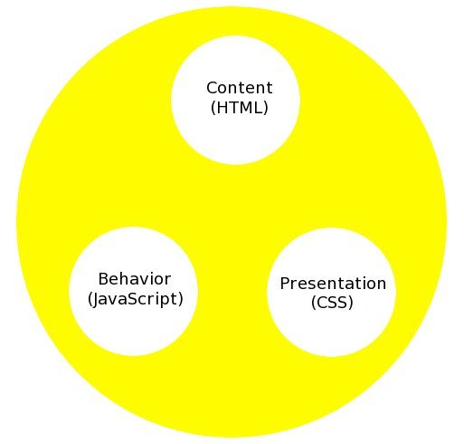

!SLIDE smbullets
# jQuery
* Questions before we get started? 

!SLIDE smbullets
# jQuery Templating
* Plugin: [http://github.com/jquery/jquery-tmpl](http://github.com/jquery/jquery-tmpl)
* API: [http://api.jquery.com/category/plugins/templates/](http://api.jquery.com/category/plugins/templates/)

!SLIDE smbullets
# Why?
* We want to separate concerns throughout our application.
* To this end we already like using the MVC model to separate logic from the view.
* We tend to muddy up the view concern though.

!SLIDE  center

!SLIDE small smbullets
* We've separated our concerns so we can eat cake now right?

!SLIDE small smbullets
* Wrong, the cake is a lie.
* The view has multiple concerns.

!SLIDE center

!SLIDE small smbullets
# The View Layer
* Content layer: The basic stuff of the page.
* Behavioral layer: Things that happen to the stuff on the page.
* Presentation layer: The way the stuff on the page looks.

!SLIDE smaller code
# Bad View SOC

    @@@javascript
    function DoThingsToStuff() {
      var newHtml = '
';
      newHtml += '<ol id="myList">';
      newHtml += '<li value="Value1">Name1</li>';
      newHtml += '<li value="Value2">Name2</li>';
      newHtml += '</ol>';
      newHtml += '
';
    }

    function ApplySomeStyle() {
      $('span#mySpan').css('color','#FFFFFF');
    }

!SLIDE
# BOO!!!!

!SLIDE small smbullets
# Why Content In Behavior Is Bad
* We have HTML in our document and our scripts.
* It's really easy to screw up markup that's surrounded by quotes.
* Poor SOC makes it harder to make changes later or find where stuff happens.

!SLIDE small smbullets
# Why Presentation In Behavior Is Bad
* We have CSS in our stylesheet and our scripts.
* It's really easy to lose track of what is applying what styles.
* It's really easy to get weird inheritance.

!SLIDE small
# jQuery Templates Helps With Content In Behavior

!SLIDE smaller code
# Some jQuery That Uses a Template
    @@@javascript
    

!SLIDE smaller code
# The Template and Some HTML
    @@@html
    

    <ol id="targetList"></ol>

!SLIDE small smbullets
# YAY!!!!

!SLIDE small smbullets
# Performance
* For large numbers of elements the templating engine is not as fast as building an HTML array.
* Execution times for a few different methods can be seen [here](https://github.com/jaredfaris/jQueryTemplateDemo).
